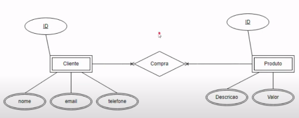
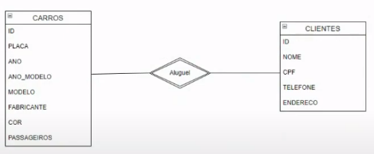
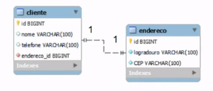
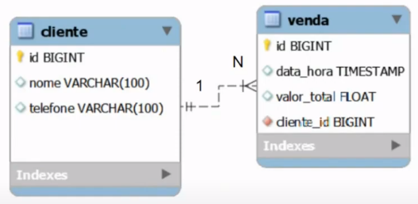
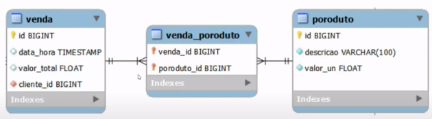

# Conceitos básicos e estrutura de Banco de Dados relacional

🛢️Banco de dados

### Banco de dados

Coleção organizada de informações ou dados, é estruturada e normalmente armazenada de forma eletrônica em um computador.  
Os bancos de dados são organizados em tabelas, que consistem em linhas (registros) e colunas (campos). 
As tabelas são projetadas para representar tipos específicos de informações, como dados de clientes, produtos, vendas, etc.

### Tipos de banco de dados:

- **Relacionais/SQL:** Os dados são organizados em tabelas relacionadas por chaves
- **Não relacionais/NoSQL (Not OnlySQL):** Modelos flexíveis de dados, adequados para dados não estruturados ou semiestruturados
- **Orientado a objetos:** Modelam os dados de uma maneira mais próxima à forma como são representados nos sistemas de programação orientada a objetos.
- **Hierárquico:** Os dados são representados como um conjunto de registros que estão inter-relacionados de maneira hierárquica, formando uma estrutura semelhante a uma árvore, com um único nó raiz conectado a vários nós filhos.
- **Em memória:** Dados são armazenados na memória para acesso ultrarápido
- **Distribuídos:** Os dados são armazenados em vários locais geográficos. Mais utilizados em redes sociais.

### SGBD:

**S**istema de **G**erenciamento de **B**anco de **D**ados - Oferecem um conjunto de ferramentas e recursos, para que seja possível criar, manipular, consultar os dados e trabalhar com a administração de segurança dos BDs. 
Exemplos de SGBDs incluem MySQL, PostgreSQL, SQL Server, Oracle, SQLite e MariaDB.

### Funções de um BD:
- **Armazenamento:** Os BDs armazenam grandes volumes de dados eficientemente
- **Recuperação:** Os dados podem ser recuperados facilmente para consultas, relatórios e análises.
- **Integridade:** Os SGBDs mantêm a integridade dos dados garantindo que eles atendam a regras e restrições predefinidas
- **Segurança:** Os BDs têm recursos de segurança para proteger os dados contra acessos não autorizados

### Funcionalidades básicas: CRUD

Create, Read, Update, Delete.

### Estrutura de um BD relacional

Composto por um BD, onde será armazenado um conjunto de todas as tabelas, que podem ter relacionamentos.

- Tabelas são compostas por colunas
- Linha/registro/tupla: informações em si
- Relacionamentos dependem de:
    - Chaves primárias: ids únicos
    - Chaves estrangeiras: sinalizam que existe um relacionamento entre as informações das tabelas

### Características:

- Relacionamento entre tabelas
- Linguagem de consulta Estruturada (SQL)
- Integridade referencial
- Normalização de dados
- Segurança
- Flexibilidade e extensibilidade
- Suporte a transações ACID: garantia da consistencia da informação no BD

### ACID:

Conjunto de proprieades de um BD relacional que garante que as operações sejam executadas de uma forma segura e confiável, para que tenhas as informações conistentes.

**Atomicidade**: garante que todas as operações de uma transação sejam executadas com sucesso, ou que nenhuma delas seja executada. Ou seja, se tivermos algum tipo de erro em alguma das nossas operações SQL, ele não vai salvar essa informação.

**Consistência**: Garante que o BD saia de um estado consistente para outro estado consistente, garantindo todas as regras e restrições definidas nas tabelas.

**Isolamento**: Cada transação é executada de forma isolada, sem interferir nas transações concorrentes para evitar acessos incorretos ou inconsistência de dados. O BD garante que uma escrita seja feita posterior a outra e não ao mesmo tempo, para que não haja perca de informação.

**Durabilidade**: Uma vez que a transação é confirmada, a alteração da informação é permanente.

[O que é um banco de dados relacional?](https://www.oracle.com/br/database/what-is-a-relational-database/)

📊 Introdução e conceitos básicos de SQL

## Introdução e conceitos básicos de SQL

- Linguagem de consulta padronizada
- Amplamente utilizada para interagir com o BD, permite escrever consultas e comandos para criar schemas, recuperar, inserir, atualizar e excluir informações, ou o próprio BD.

### Organização da SQL

- DQL - Linguagem de Consulta de Dados
    - SELECT
- DML - Linguagem de Manipulação de dados
    - INSERT, UPDATE, DELETE
- DDL - Linguagem de Definição de Dados
    - CREATE, ALTER, DROP
- DCL - Linguagem de Controle de Dados
    - GRANT, REVOKE
- DTL - Linguagem de Transação de Dados
    - BEGIN, COMMIT, ROLLBACK

### Sintaxe básica: nomenclatura

- Os nomes devem começar com uma letra ou underline(_)
- Os nomes podem conter letras, números e underline
- Diferenciam maiúsculas e minúsculas

[SQL Tutorial - Essential SQL For The Beginners](https://www.sqltutorial.org/)

### MER E DER: Modelagem de Banco de Dados

- O Modelo Entidade-Relacionamento (MER) é representado através de diagramas chamados Diagramas Entidade-Relacionamento (DER)

### Entidades:

Representação das tabelas - são nomeadas com substantivos concretos ou abstratos que representem de forma clara sua função dentro do domínio

### Atributos:

Características e propriedades de cada uma das entidades. Eles descrevem informações específicas sobre uma entidade.

| usuarios |
| --- |
| nome |
| email |
| senha |

### Relacionamentos

Representam as associações entre as entidades. Representados por losangos.

Exemplo: Em um sistema de gerenciamento de uma locadora de veículos,
modele a relação entre um cliente e um veículo. Considere os
atributos e as operações necessárias para representar esse
relacionamento de forma eficaz, levando em conta a
possibilidade de aluguel, devolução, manutenção e informações
associadas a ambos os clientes e veículos. Descreva as
entidades envolvidas e as cardinalidades das associações, bem
como quaisquer propriedades ou restrições importantes que
devem ser consideradas na modelagem.

[App Diagrams](https://app.diagrams.net/)

### -> Relacionamento 1-1 (Um para um)
Acontece quando cada coisa em um lado está conectada a apenas uma coisa do outro lado.

### -> Relacionamento 1-N (Um para muitos)
Acontece quando algo de um lado está relacionado a várias coisas do outro lado.

### -> Relacionamento N-N (Muitos para muitos)
Acontece quando muitas coisas de um lado estão relacionadas a muitas coisas do outro lado.

### Cardinalidade

Refere-se a forma como as entidades se relacionam umas com as outras, e indica o número máximo de instâncias ou ocorrências que pode ter de uma entidade associada a outra.

- Relacionamento 1..1 (um para um): uma instância de uma entidade pode estar associada no máximo a uma instância de uma outra entidade.
- Relacionamento 1..n ou 1..* (um para muitos): uma instância de uma entidade pode estar associada a várias outras instâncias das outras entidades.
- Relacionamento n..n ou **..** (muitos para muitos): várias instâncias de várias entidades estão associadas a várias outras instâncias de várias entidades.

## Tabelas, colunas e registros

- **Tabelas**: são usadas para armazenar dados de forma organizada. Cada tabela em um banco de dados relacional tem um nome único e é dividida em colunas e linhas.
- **Colunas**: estrutura dentro de uma tabela que representa um atributo específico dos dados armazenados. Cada coluna tem um nome único e um tipo de dados associado que define o tipo de informação que pode ser armazenado nela, como números, textos, datas, etc.
- **Registro**: também conhecido como linha ou tupla, é uma instância individual de dados em uma tabela.

### Comando: CREATE TABLE

CREATE TABLE NOME

(coluna tipo opções COMMENT

‘COMENTARIO’)

### Tipos de dados:

- Inteiro (integer)
- Decimal/Numérico (Decimal/Numeric)
- Caractere/Varchar (Character/varchar)
- Data/Hora (Date/Time)
- Booleano (Boolean)
- Texto longo (text)
- Enums (enumerações): Um tipo de dado especial que permite definir um conjunto fixo de valores permitidos para uma coluna, como opções de dias da semana.

### Restrições de valor:

- **NOT NULL**: o valor não pode ser nulo
- **UNIQUE**: exemplo - um e-mail deve ser unicamente de um usuário
- **DEFAULT**: exemplo - toda reserva no momento em que é criada tem o status criada
- **Chaves primárias e estrangeiras:**
- **Auto incremento**

