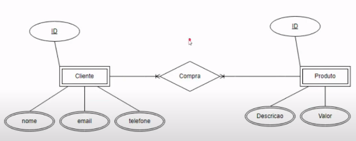
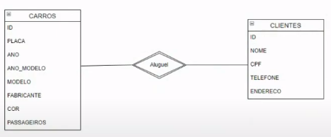
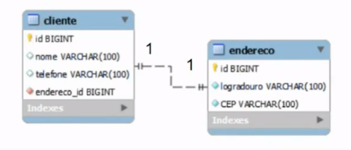
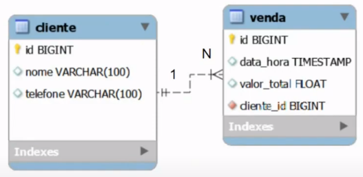
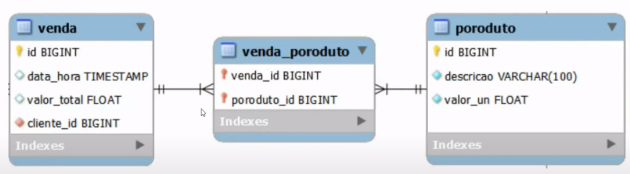
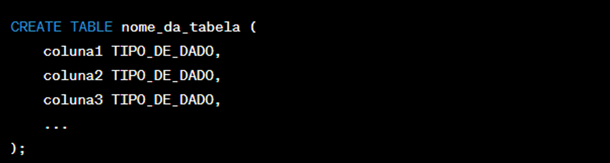
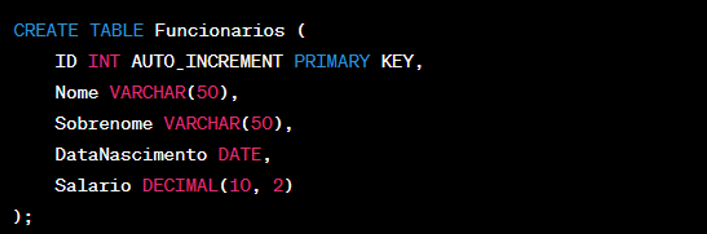
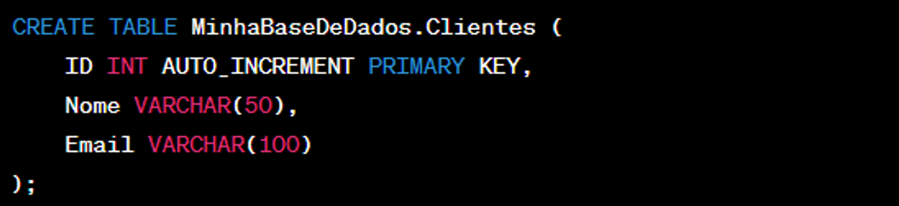
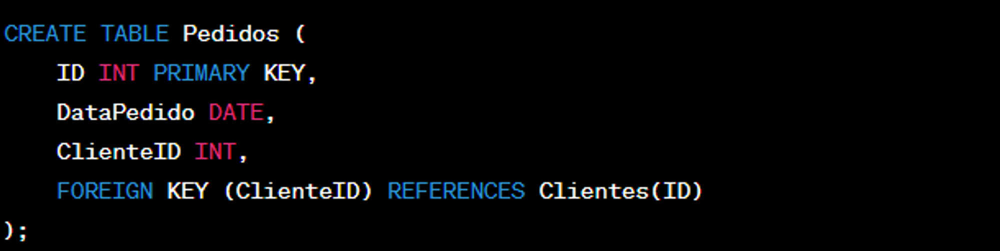

# Conceitos básicos e estrutura de Banco de Dados relacional

🛢️Banco de dados

### Banco de dados

Coleção organizada de informações ou dados, é estruturada e normalmente armazenada de forma eletrônica em um computador.  
Os bancos de dados são organizados em tabelas, que consistem em linhas (registros) e colunas (campos). 
As tabelas são projetadas para representar tipos específicos de informações, como dados de clientes, produtos, vendas, etc.

### Tipos de banco de dados:

- **Relacionais/SQL:** Os dados são organizados em tabelas relacionadas por chaves
- **Não relacionais/NoSQL (Not OnlySQL):** Modelos flexíveis de dados, adequados para dados não estruturados ou semiestruturados
- **Orientado a objetos:** Modelam os dados de uma maneira mais próxima à forma como são representados nos sistemas de programação orientada a objetos.
- **Hierárquico:** Os dados são representados como um conjunto de registros que estão inter-relacionados de maneira hierárquica, formando uma estrutura semelhante a uma árvore, com um único nó raiz conectado a vários nós filhos.
- **Em memória:** Dados são armazenados na memória para acesso ultrarápido
- **Distribuídos:** Os dados são armazenados em vários locais geográficos. Mais utilizados em redes sociais.

### SGBD:

**S**istema de **G**erenciamento de **B**anco de **D**ados - Oferecem um conjunto de ferramentas e recursos, para que seja possível criar, manipular, consultar os dados e trabalhar com a administração de segurança dos BDs. 
Exemplos de SGBDs incluem MySQL, PostgreSQL, SQL Server, Oracle, SQLite e MariaDB.

### Funções de um BD:
- **Armazenamento:** Os BDs armazenam grandes volumes de dados eficientemente
- **Recuperação:** Os dados podem ser recuperados facilmente para consultas, relatórios e análises.
- **Integridade:** Os SGBDs mantêm a integridade dos dados garantindo que eles atendam a regras e restrições predefinidas
- **Segurança:** Os BDs têm recursos de segurança para proteger os dados contra acessos não autorizados

### Funcionalidades básicas: CRUD

Create, Read, Update, Delete.

### Estrutura de um BD relacional

Composto por um BD, onde será armazenado um conjunto de todas as tabelas, que podem ter relacionamentos.

- Tabelas são compostas por colunas
- Linha/registro/tupla: informações em si
- Relacionamentos dependem de:
    - Chaves primárias: ids únicos
    - Chaves estrangeiras: sinalizam que existe um relacionamento entre as informações das tabelas

### Características:

- Relacionamento entre tabelas
- Linguagem de consulta Estruturada (SQL)
- Integridade referencial
- Normalização de dados
- Segurança
- Flexibilidade e extensibilidade
- Suporte a transações ACID: garantia da consistencia da informação no BD

### ACID:

Conjunto de proprieades de um BD relacional que garante que as operações sejam executadas de uma forma segura e confiável, para que tenhas as informações conistentes.

**Atomicidade**: garante que todas as operações de uma transação sejam executadas com sucesso, ou que nenhuma delas seja executada. Ou seja, se tivermos algum tipo de erro em alguma das nossas operações SQL, ele não vai salvar essa informação.

**Consistência**: Garante que o BD saia de um estado consistente para outro estado consistente, garantindo todas as regras e restrições definidas nas tabelas.

**Isolamento**: Cada transação é executada de forma isolada, sem interferir nas transações concorrentes para evitar acessos incorretos ou inconsistência de dados. O BD garante que uma escrita seja feita posterior a outra e não ao mesmo tempo, para que não haja perca de informação.

**Durabilidade**: Uma vez que a transação é confirmada, a alteração da informação é permanente.

[O que é um banco de dados relacional?](https://www.oracle.com/br/database/what-is-a-relational-database/)

📊 Introdução e conceitos básicos de SQL

## Introdução e conceitos básicos de SQL

- Linguagem de consulta padronizada
- Amplamente utilizada para interagir com o BD, permite escrever consultas e comandos para criar schemas, recuperar, inserir, atualizar e excluir informações, ou o próprio BD.

### Organização da SQL

- DQL - Linguagem de Consulta de Dados
    - SELECT
- DML - Linguagem de Manipulação de dados
    - INSERT, UPDATE, DELETE
- DDL - Linguagem de Definição de Dados
    - CREATE, ALTER, DROP
- DCL - Linguagem de Controle de Dados
    - GRANT, REVOKE
- DTL - Linguagem de Transação de Dados
    - BEGIN, COMMIT, ROLLBACK

### Sintaxe básica: nomenclatura

- Os nomes devem começar com uma letra ou underline(_)
- Os nomes podem conter letras, números e underline
- Diferenciam maiúsculas e minúsculas

[SQL Tutorial - Essential SQL For The Beginners](https://www.sqltutorial.org/)

### MER E DER: Modelagem de Banco de Dados

- O Modelo Entidade-Relacionamento (MER) é representado através de diagramas chamados Diagramas Entidade-Relacionamento (DER)

### Entidades:

Representação das tabelas - são nomeadas com substantivos concretos ou abstratos que representem de forma clara sua função dentro do domínio

### Atributos:

Características e propriedades de cada uma das entidades. Eles descrevem informações específicas sobre uma entidade.

| usuarios |
| --- |
| nome |
| email |
| senha |

### Relacionamentos

Representam as associações entre as entidades. Representados por losangos.

Exemplo: Em um sistema de gerenciamento de uma locadora de veículos,
modele a relação entre um cliente e um veículo. Considere os
atributos e as operações necessárias para representar esse
relacionamento de forma eficaz, levando em conta a
possibilidade de aluguel, devolução, manutenção e informações
associadas a ambos os clientes e veículos. Descreva as
entidades envolvidas e as cardinalidades das associações, bem
como quaisquer propriedades ou restrições importantes que
devem ser consideradas na modelagem.

[App Diagrams](https://app.diagrams.net/)

### Cardinalidade:

Refere-se a forma como as entidades se relacionam umas com as outras, e indica o número máximo de instâncias ou ocorrências que pode ter de uma entidade associada a outra.

### Relacionamento 1-1 (um para um):
uma instância de uma entidade pode estar associada no máximo a uma instância de uma outra entidade.

### Relacionamento 1-N (um para muitos):
uma instância de uma entidade pode estar associada a várias outras instâncias das outras entidades.

### Relacionamento N-N (muitos para muitos):

várias instâncias de várias entidades estão associadas a várias outras instâncias de várias entidades.

## Tabelas, colunas e registros

- **Tabelas**: são usadas para armazenar dados de forma organizada. Cada tabela em um banco de dados relacional tem um nome único e é dividida em colunas e linhas.
- **Colunas**: estrutura dentro de uma tabela que representa um atributo específico dos dados armazenados. Cada coluna tem um nome único e um tipo de dados associado que define o tipo de informação que pode ser armazenado nela, como números, textos, datas, etc.
- **Registro**: também conhecido como linha ou tupla, é uma instância individual de dados em uma tabela.

### Comando: CREATE TABLE

CREATE TABLE NOME

(coluna tipo opções COMMENT

‘COMENTARIO’)

### Tipos de dados:

- Inteiro (integer)
- Decimal/Numérico (Decimal/Numeric)
- Caractere/Varchar (Character/varchar)
- Data/Hora (Date/Time)
- Booleano (Boolean)
- Texto longo (text)
- Enums (enumerações): Um tipo de dado especial que permite definir um conjunto fixo de valores permitidos para uma coluna, como opções de dias da semana.

### Restrições de valor:

- **NOT NULL**: o valor não pode ser nulo
- **UNIQUE**: exemplo - um e-mail deve ser unicamente de um usuário
- **DEFAULT**: exemplo - toda reserva no momento em que é criada tem o status criada
- **Chaves primárias e estrangeiras:**
- **Auto incremento**

💾 Introdução às Linguagens de Definição de Dados (DDL) em Bancos de Dados

## Linguagens de Definição de Dados (DDL)

A Linguagem de Definição de Dados (DDL) é uma linguagem de programação utilizada para definir e gerenciar a estrutura de um banco de dados. Ela permite que os desenvolvedores criem, modifiquem e excluam objetos de banco de dados, como tabelas, índices, visões e restrições. Resumindo, ela é usada para criar, modificar e excluir estruturas de banco de dados, como tabelas, índices e restrições. A DDL é uma parte fundamental no mundo dos bancos de dados.

Antes de mais nada, é importante ressaltar que existem algumas diferenças significativas entre as linguagens SQL de um SGBD (Sistema de Gerenciamento de Banco de Dados) para outro. No entanto, neste conteúdo, o foco estará na base de dados MariaDB. É relevante destacar que, geralmente, as consultas SQL que discutiremos a seguir são perfeitamente aplicáveis ao MySQL, uma vez que o MariaDB é um fork do MySQL e ambos compartilham uma base de código semelhante. Portanto, as SQLs apresentadas aqui podem ser facilmente adaptadas para ambas as plataformas, o que torna esse conhecimento ainda mais valioso para quem trabalha com bancos de dados relacionais.

Adicionalmente, para a execução das SQLs que abordaremos neste conteúdo, é fundamental que o usuário tenha o SGBD (Sistema de Gerenciamento de Banco de Dados), de sua escolha, devidamente instalado e rodando em sua máquina local. Ter o SGBD funcionando no ambiente de desenvolvimento é um pré-requisito essencial para a prática e experimentação das consultas SQL. Portanto, antes de prosseguir com a execução dos comandos, certifique-se de que o MariaDB ou o MySQL estejam instalados, configurados e inicializados corretamente em seu sistema, garantindo assim uma experiência eficaz e produtiva na gestão de bancos de dados.

## Comandos DDL Básicos

### Criar uma Base de Dados

Para criar uma nova base de dados, você pode usar o comando SQL `CREATE DATABASE`. Por exemplo, para criar uma base de dados chamada "minhabasededados", você pode executar o seguinte comando:

Ao criar uma base de dados, você deve ter muita atenção na escolha do nome, pois ela não poderá ser renomeada. O processo de renomeação de uma base passa por salvar os dados em um arquivo externo (fazer backup), criar a base com um novo nome, restaurar os dados para a nova base e excluir a base antiga.

### Excluir uma Base de Dados:

Para excluir uma base de dados, utilize o comando SQL `DROP DATABASE`. Certifique-se de ter certeza de que deseja excluir a base de dados, pois essa ação é irreversível e todos os dados serão perdidos. Por exemplo, para excluir a base de dados "minhabasededados", você pode executar o seguinte comando:

### Criando Tabelas em uma base de dados:

O comando para criação de uma tabela é o `CREATE TABLE`, vejamos um exemplo de sua sintaxe:

A Figura 3 apresenta os elementos necessários para a criação de uma tabela em uma base de dados:

- `CREATE TABLE`: Este é o comando que indica que você está criando uma nova tabela.
- `nome_da_tabela`: Substitua isso pelo nome da tabela que você deseja criar.
- `coluna1`, `coluna2`, `coluna3`, ...: Essas são as colunas que você deseja que a tabela tenha. Você precisa especificar o nome de cada coluna.
- `TIPO_DE_DADO`: Especifica o tipo de dado que cada coluna pode armazenar. Por exemplo, você pode usar `INT` para números inteiros, `VARCHAR(255)` para strings de até 255 caracteres, `DATE` para datas, entre outros tipos de dados. Cada coluna deve ser seguida pelo seu tipo de dado.

Aqui está um exemplo de criação de uma tabela de funcionários:

Neste exemplo, estamos criando uma tabela chamada "Funcionarios" com cinco colunas: ID, Nome, Sobrenome, DataNascimento e Salario. Cada coluna tem um tipo de dado apropriado.

Além disso, notamos que a coluna "ID" é definida como `INT AUTO_INCREMENT PRIMARY KEY`. Isso significa que a coluna "ID" será uma chave primária (primary key) e terá valores gerados automaticamente (auto increment), garantindo que cada registro tenha um valor de ID único.

Para criar uma tabela é preciso especificar a base que recebera o comando, esta escolha pode ser feita de duas maneiras, a primeira é determinar no memento do comando `CREATE`. Como no exemplo a seguir:

No exemplo anterior, uma tabela chamada "Clientes" foi criada na base de dados "MinhaBaseDeDados". Essa especificação garante que a tabela gerada siga o planejado pelo projetista. Ao se omitir essa informação, o banco de dados criará a tabela na base selecionada. Caso nenhuma base esteja selecionada, ele retornará um erro de sintaxe SQL. Para selecionar uma base para realizar todas as interações nela, utilize o comando USE, como apresentado no exemplo a seguir:

É importante ressaltar que, após a execução do comando `USE DATABASE`, todos os comandos digitados a seguir serão automaticamente executados na base selecionada.

Em muitos cenários, à medida que um projeto evolui, é necessário realizar alterações nas tabelas de um banco de dados. Isso pode envolver a adição ou exclusão de colunas, bem como a modificação do tipo ou do tamanho de uma coluna existente. O MariaDB oferece comandos SQL que permitem realizar essas operações de forma controlada e eficaz.

### Manipulando colunas de uma tabela

Para adicionar uma nova coluna a uma tabela existente, utilize o comando `ALTER TABLE`. Suponhamos que você queira adicionar uma coluna "Telefone" à tabela "Clientes" da base de dados "MinhaBaseDeDados":

Isso adicionará uma nova coluna chamada "Telefone" à tabela "Clientes" na última coluna. Já para adicionar na primeira posição da tabela você usaria a palavra reservada `FIRST`, como no exemplo a seguir:

Já para adicionar a coluna a uma posição determinada, pode-se usar a palavra `AFTER` seguido do nome da coluna que se deseja utilizar como referência para inserção, exemplo:

As alterações em tabelas não se limitam apenas na inserção de novas colunas, também é possível modificar o tipo e o tamanho de uma coluna existente, use o comando `ALTER TABLE` com a cláusula `MODIFY COLUMN`. Por exemplo, se você desejar alterar o tipo da coluna "Nome" de "VARCHAR(50)" para "VARCHAR(100)", faça o seguinte:

Isso alterará o tipo e o tamanho da coluna "Nome" de 50 para 100 caracteres. Além disso, pode-se usar a cláusula `CHANGE COLUMN` para reorganizar as colunas existentes em uma tabela. Por exemplo, se você desejar mover a coluna "Telefone" para a primeira posição na tabela "Clientes", você pode fazer o seguinte:

Figura 11 - SQL que reorganiza a posição de uma coluna na tabela.

Isso reorganizará a coluna "Telefone" para a primeira posição na tabela. Por fim, caso uma coluna não seja mais necessária, poderá ser excluída permanentemente. Para isso, utilize o comando `ALTER TABLE` com a cláusula `DROP COLUMN`. Veja o exemplo de exclusão da coluna "Email" da tabela "Clientes" a seguir:

Figura 12 - SQL que exclui a coluna "Email" da tabela "Clientes".

### Alterando chave primaria

Para promover uma coluna a chave primária em uma tabela no MariaDB, você pode usar o comando `ALTER TABLE` em conjunto com a cláusula `ADD PRIMARY KEY`. Aqui está como fazer isso:

SQL que promove a coluna ID para chave primaria.

Isso define a coluna "ID" como a chave primária da tabela "Clientes". Certifique-se de que a coluna que você deseja promover como chave primária contenha valores únicos e não contenha valores nulos, pois a chave primária deve ser exclusiva e não nula. Além disso, se a tabela já tiver uma chave primária existente, você precisará removê-la antes de definir a nova chave primária. Use o comando `DROP PRIMARY KEY` para remover a chave primária anterior:

SQL que remove a chave primaria da tabela.

### Criando Chaves Estrangeiras:

As chaves estrangeiras (foreign keys) são elementos cruciais no design de bancos de dados relacionais, pois estabelecem relacionamentos entre tabelas, mantendo a integridade referencial dos dados. No MariaDB, você pode adicionar chaves estrangeiras de duas maneiras: durante a criação da tabela ou posteriormente, por meio da alteração de uma tabela existente.

### Adicionando Chaves Estrangeiras Durante a Criação da Tabela:

Durante a criação da tabela, você pode definir uma chave estrangeira diretamente na declaração da tabela. Isso garante que a integridade referencial seja mantida desde o início. Veja um exemplo:

Exemplo de criação de tabela com chave estrangeira.

Nesse exemplo, a tabela "Pedidos" é criada com uma coluna "ClienteID" que atua como uma chave estrangeira, referenciando a tabela "Clientes" pela coluna "ID". Essa abordagem é preferível quando se projeta um banco de dados desde o início.

### Adicionando Chaves Estrangeiras Após a Criação da Tabela:

Caso você precise adicionar uma chave estrangeira a uma tabela existente, use o comando `ALTER TABLE`. Por exemplo, suponha que você já tenha uma tabela "Pedidos" e deseje adicionar uma chave estrangeira para a coluna "ClienteID":

Alterando tabela e promovendo coluna a chave estrangeira.

Neste caso, o comando `ALTER TABLE` permite adicionar a chave estrangeira após a criação da tabela. Certifique-se de que a tabela de referência ("Clientes" no exemplo) já exista antes de adicionar a chave estrangeira.

Independentemente do método escolhido, as chaves estrangeiras desempenham um papel fundamental na garantia da integridade dos dados em seu banco de dados MariaDB, tornando possível a criação de relacionamentos significativos entre tabelas. Lembre-se de fazer backup de seus dados antes de realizar qualquer alteração na estrutura da tabela para evitar a perda acidental de informações.

